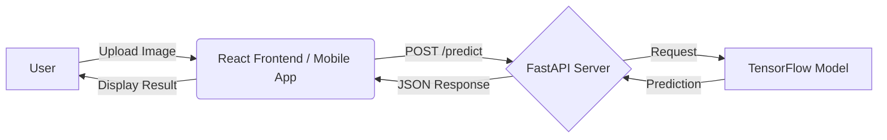

# 🥔 Potato Disease Classification

   

## 🚀 Project Overview

This project is an end-to-end Deep Learning application designed to help farmers and agriculturalists identify diseases in potato plants. Using a Convolutional Neural Network (CNN) trained on the **PlantVillage** dataset, the system classifies potato leaf images into three categories:

* **Early Blight**
* **Late Blight**
* **Healthy**

The solution includes a trained model, a FastAPI backend server for inference, a React.js web frontend, and a React Native mobile application, with deployment capabilities on Google Cloud Platform (GCP).

---

## Output Screenshots

### **Landing Page**


### **Prediction Result**


## 🏗️ Architecture

The system follows a microservices architecture where the frontend communicates with a FastAPI backend. The backend utilizes TensorFlow Serving (or a loaded `.h5` model) to perform inference on images.



## 🛠️ Tech Stack

| Component | Technology | Description |
| :--- | :--- | :--- |
| **Deep Learning** | Python, TensorFlow, Keras | CNN Model training & Data Augmentation |
| **Backend** | FastAPI, Uvicorn | High-performance API server |
| **Model Serving** | TensorFlow Serving | Production-grade model serving system |
| **Frontend** | React.js | Web interface for image upload & prediction |
| **Mobile** | React Native | Mobile application for field usage |
| **Deployment** | Google Cloud Platform (GCP) | Google Cloud Functions & Storage |
| **Tools** | Jupyter, Postman, Docker | Development and testing tools |

---

## 💻 Setup & Installation

Follow these steps to set up the project locally.

### 1. Prerequisites
Ensure you have the following installed:
* **Python 3.8+**
* **Node.js & npm**
* **Docker** (optional, for TF Serving)

### 2. Backend Setup (FastAPI)

```bash
# Navigate to the API directory
cd api

# Install dependencies
pip install -r requirements.txt

# Run the FastAPI server
uvicorn main:app --reload --host 0.0.0.0 --port 8000
```
### 3. Frontend Setup (React.js)

```bash
# Navigate to the frontend directory
cd frontend

# Install dependencies
npm install

# Start the development server
npm start
```
### 4. Model Training (Optional)
If you wish to retrain the model:
1. Open `training/potato-disease-training.ipynb` in Jupyter Notebook.
2. Download the dataset from **Kaggle**.
3. Run the cells to train and save the model to the `models/` directory.

---

## 📂 Project Structure

```text
potato-disease-classification/
├── api/                    # FastAPI backend
│   ├── main.py             # API entry point
│   └── requirements.txt    # Python dependencies
├── frontend/               # React.js Web Application
│   ├── src/                # Source code
│   ├── public/             # Static assets
│   └── package.json        # Node dependencies
├── mobile-app/             # React Native Mobile App
├── models/                 # Saved TensorFlow models
│   ├── 1/                  # Version 1 of the model
│   └── potato_model.h5     # H5 format model
├── training/               # Jupyter Notebooks
│   ├── potato-disease-training.ipynb
│   └── tf-lite-converter.ipynb
├── gcp/                    # Google Cloud Function scripts
└── README.md               # Project documentation
```
## 🙌 Acknowledgements

* **Dataset:** [PlantVillage](https://www.kaggle.com/arjuntejaswi/plant-village) via Kaggle.
