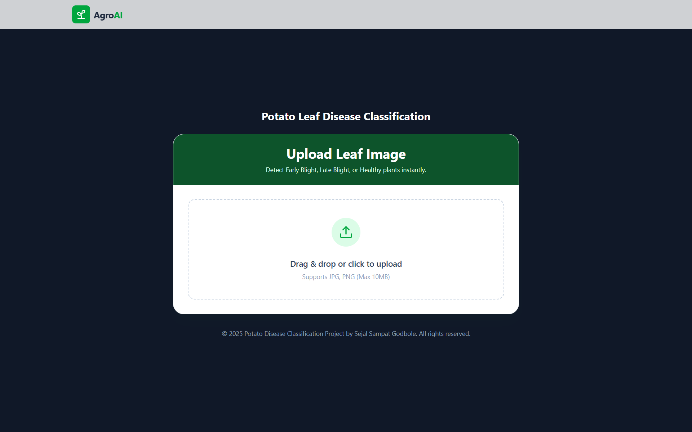

# 🥔 Potato Disease Classification — End-to-End Deep Learning Project

An end-to-end Deep Learning application capable of detecting **Early Blight**, **Late Blight**, and **Healthy** potato leaves with high accuracy.  
This system uses a **Convolutional Neural Network (CNN)** for classification, served via **TensorFlow Serving (Docker)**, connected to a **FastAPI backend**, and displayed through a modern **React frontend**.

---

## 📸 Output Screenshots

### **Landing Page**


### **Prediction Result**


---

## 🚀 Project Architecture

This project follows a **microservices architecture**:

- **Frontend (React + Tailwind + Vite):** User uploads leaf images  
- **FastAPI Gateway:** Preprocesses the image & forwards request  
- **TensorFlow Serving (Docker):** Hosts the trained model and performs inference  


## 🛠️ Tech Stack

### **Machine Learning**
* TensorFlow / Keras
* Convolutional Neural Networks (CNN)
* PlantVillage Dataset

### **Backend**
* FastAPI
* Python
* Uvicorn
* TensorFlow Serving

### **Frontend**
* React.js
* Vite
* Tailwind CSS
* Axios

### **Tools**
* Docker
* VS Code
* Postman
* Google Colab

---

## 🧠 Model Performance

The model was trained on the **PlantVillage** dataset.

| Metric | Value |
| :--- | :--- |
| **Validation Accuracy** | ~98% |
| **Classes** | Early Blight, Late Blight, Healthy |

### Class Labels
```json
[
    "Potato___Early_blight",
    "Potato___Late_blight",
    "Potato___healthy"
]

---

## 💻 Setup & Installation

Follow these steps to run the full system locally.

### 1. Prerequisites
Ensure you have the following installed:
* **Docker Desktop**
* **Python 3.8+**
* **Node.js** (Latest LTS)
* **Git**

### 2. Clone the Repository
```bash
git clone [https://github.com/YOUR_USERNAME/potato-disease-classification.git](https://github.com/YOUR_USERNAME/potato-disease-classification.git)
cd potato-disease-classification

### 3. Start TensorFlow Serving (Docker)

Make sure your `models.config` file path is correct.

```bash
docker run -t --rm -p 8501:8501 \
    -v C:/Resume_projects/Potato-disease-classification:/potato-disease-classification \
    tensorflow/serving \
    --model_config_file=/potato-disease-classification/models.config \
    --model_config_file_poll_wait_seconds=60

### 4. Start the Backend (FastAPI)

Navigate to the API directory and install dependencies:

```bash
cd api
pip install -r requirements.txt
uvicorn main:app --reload

### 5. Start the Frontend (React)

Navigate to the frontend directory and install dependencies:

```bash
cd frontend
npm install
npm run dev

## 📂 Project Structure

```text
potato-disease-classification/
├── api/                     # FastAPI Backend
│   ├── main.py              # API Routes & Logic
│   └── requirements.txt     # Dependencies
│
├── frontend/                # React Frontend
│   ├── src/                 # Components
│   └── tailwind.config.js   # Styles
│
├── saved_models/            # Trained TF Models
│   └── 1/                   # Version 1 (SavedModel format)
│
├── training/                # Jupyter Notebooks
│   └── potato-disease.ipynb # Model Training Code
│
├── models.config            # TF Serving Config
└── README.md                # Documentation

## 🤝 Acknowledgements

* **Dataset:** PlantVillage